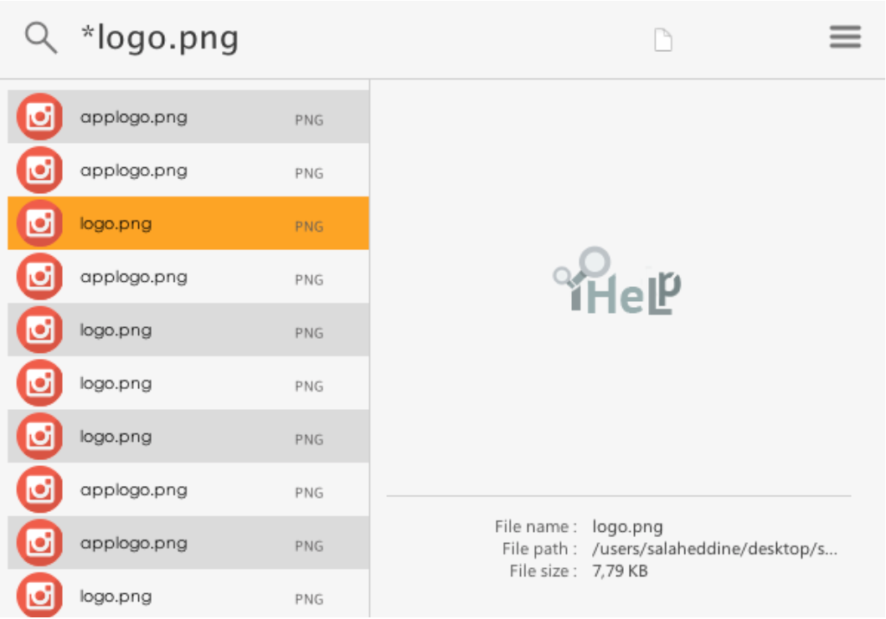
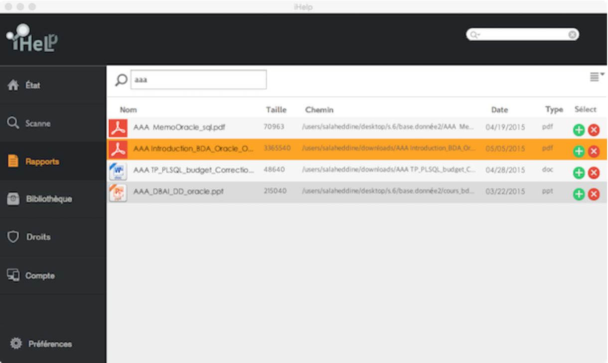

# CONCEPTION ET DÉVELOPPEMENT D'UNE APPLICATION DE GESTION DES DOCUMENTS 

Parfois on risque de perdre l’information ou bien on prend énormément de temp pour la trouver à cause de la grande masse de cette dernière, qu'il a été accueilli jour après jour... Alors comment faire pour éviter la perte des données? ou plutôt comment gérer vos fichiers quotidien. 

D’ou vient la notion de la gestion des documents, qui offre la possibilité de organiser les documents selon les besoins.

La gestion des documents n’a été jamais facile que ça, l’application « **iHelp** » assure la simplicité de gérer les documents, à partir de différentes informations caractérisant cette dernière (soit par le nom, l’extension, la date, la taille,le mot-clé ...) des documents. Grâce à des algorithmes développés de recherche et de scanne, on trouve les fichiers recherchés plus vite sans surcharger la machine. 

« **iHelp** » permet aussi de créer des bibliothèques qui sert a regrouper les fichiers d’une manière très organisée et les synchroniser en ligne dans un cloud choisix, en conséquent on peux y-accéder par tout dans le web et aussi avoir la possibilité de les partager avec les amis. 

###  Installation
Maintenant que le codage est terminé, on peut passer à l’installation d’environnement Java, qui installera d’abord les modules auxquels il est lié. Avant de utiliser l’application **iHelp**, on doit d’abord Scanner la machine (le scanne est implicite sur la version lite), ensuite on lance la recherche des fichiers souhaités , et nous pourrons à ce stade, ajouter des nouveaux fichiers aux bibliothèques préalablement créer.
Bien évidemment, on doit d’abord se connecter avant la gestion des bibliothèques.

#### Vue général de l'application ( Version Lite) : 

#### Vue général de l'application ( Version Complète) :

